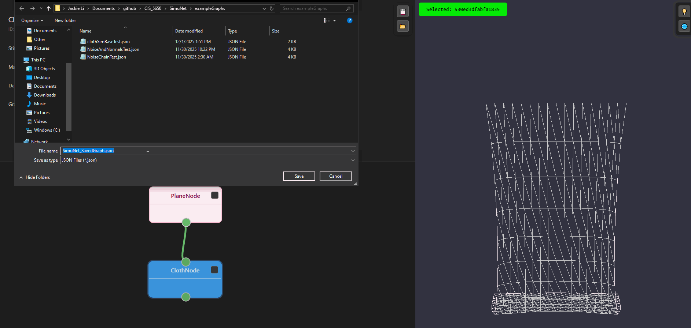
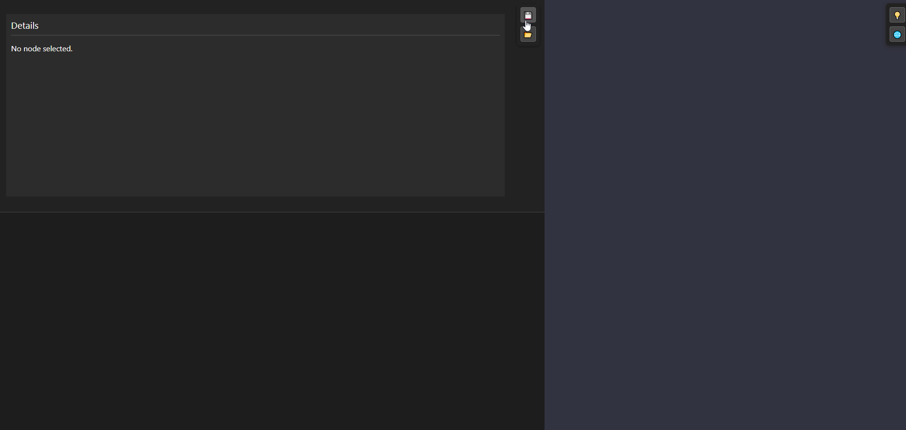
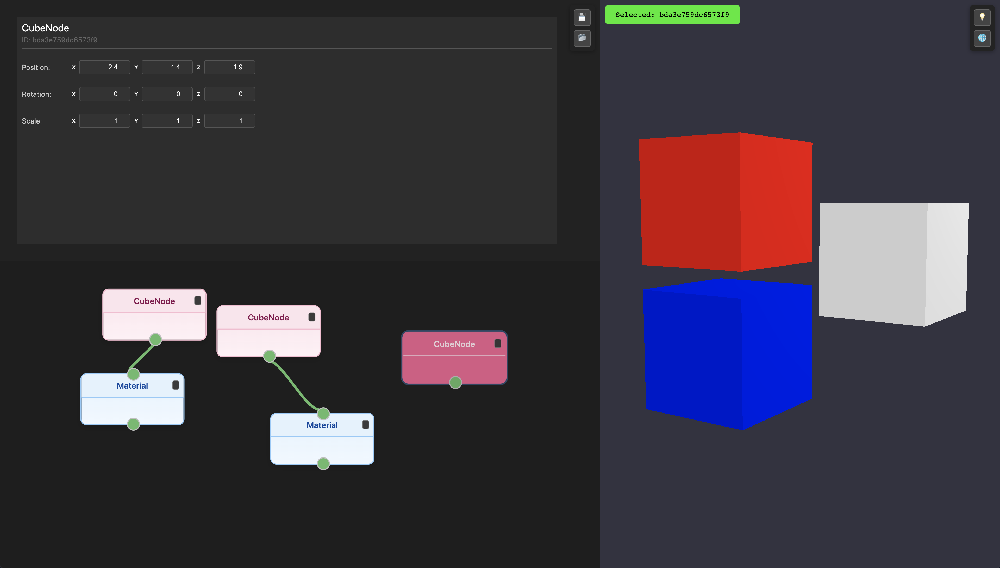

# SimuNet

A WebGPU Node Based Procedural Generator focusing on simulations.

[Demo link](https://sagescherrytree.github.io/SimuNet/)

### Instructions
GUI:
* The top left section is the Details Panel for each node
* The bottom left section is where the nodes sit (and can be created)
* The right section is where the geometry will be rendered

Camera Control
* To move around, you can hold right click down and use WASDEQ to move around
* Scroll buttom zooms in and out
* Middle button pans
* Right Click rotates

To create a new node, move your mouse into the bottom left section and right click. A node menu should pop up and you can select the nodes created.

## Concept and Goal

Our concept is very simple; to make a node based procedural tool on WebGPU, because it is simple to access, and runs fast on a GPU. Similar to Houdini, this system would use nodes to spawn geometry, and one can modify them also through node based logic. We propose to use nodes corresponding to compute shaders to act on all the data which is passed through. Parameters, if present, will be exposed via nodes, which is the visual component that the user is able to interact with. WebGPU is also used to render the results of each of the compute shaders, so the user can easily follow what happens in each step of the process, in addition to it being fast as it runs on the GPU. 

## Simulations

SimuNet will be focused on simulations, as its name implies. We will be focusing on implementing the following physics based simulations for the time being.

#### Proposed Simulations

- [ ] cloth simulation
- [ ] noise based deformation
- [ ] rigidbody

We aim to construct the system such that we can easily add in new simulations as compute shaders to modify the input. 

## Milestone 1

[Presentation Link](https://docs.google.com/presentation/d/1P4i5c0qahVdIlbv1cDaszm3CENs7U_gj6FwvsZWp5yE/edit?usp=sharing)

#### Milestone 1 Goals

- [x] Basic node functionality.
- [x] Basic GUI using React.js and Rete.js.
- [x] Renderer to visualise primitives.
- [x] Basic geometry nodes (cube, icosphere, transform).

For Milestone 1, we completed the skeleton for our node network. We used the Rete.js library to construct the node GUI, and we set up the basic renderer.ts pipeline to render cubes and icospheres to the viewport. We also implemented the node connection structure (naive), and transform node which modifies the input geometry. 

## Milestone 2

#### Milestone 2 Goals

- [X] Restructured Milestone 1 code.
- [X] Noise and deformation node (GPU).
- [X] More base geometries.
- [X] Rendering options (basic lambert shader).

### Code Restructuring

### New Nodes and Features

#### Noise Node

Our noise node now contains three options for noise.

|  |  |  |
|:--:|:--:|:--:|
| Simple Noise | Worley Noise | Perlin Noise |

The noise modifications all now run via compute shaders.

#### Plane Node

Our plane node now includes subdivisions! 

|  |  |
|:--:|:--:|
| Subdivision = 1 | Subdivision = 16 |

### Compute Pipeline

In this milestone, we introduce a compute pipeline to run our modifications to each of the primitives that we create. Illustrated in the diagram above, we create vertex buffers and index buffers to hold the primitive data. In the modification nodes (e.g. the TransformNode in the example), the vertex buffers and index buffers get passed through the node, and will be updated for any new modification. 

Let us take the TransformNode as an example to look at how modifications are propagated. Each node, as stated above, will take in its source vertex buffer and source index buffer. For Transformations, we only specifically modify the vertex buffer. This gets modified through a compute pass, where the buffer gets passed into a compute shader that applies the transformation, and the results then get saved in an output vertex buffer and propagated further downstream. For each update, only the current node and its descendents get updated.

Currently, we use multiple draw calls, one per each object that is set to be visible, to update our geometry visuals on the renderer.

### Rendering Options

Output meshes can be displayed using simple normal-based lighting or using a gradient based on vertex positions. They can also be viewed either as solid objects or as wireframes.

https://github.com/user-attachments/assets/838f89b6-0260-4624-a93a-32b23c7baa30

## Milestone 3

#### Milestone 3 Goals

- [X] Cloth Simulation
- [X] Import/export
- [X] Basic Color Material

### Cloth Simulation
For our cloth simulation, we decided to treat the vertices as interconnected particles forming a grid (for a plane). We use a mass-spring model where the cloth grid is defined by particles connected by springs. Currently, the system uses Structural and Shear springs (neighbors and diagonals) to resist stretching and help maintain its shape.

The primary forces in this simulation are gravity and spring forces (using Hooke's Law). We also utilize Verlet Integration for more stable and efficient particle movement updates, handling the position, velocity, and previous position tracking.

We implemented very basic floor collision, preventing particles from falling below Y=0.

The simulation logic is offloaded to a WebGPU Compute Shader, which processes all of the particles in parallel. Particle data (position, previous position, mass, fixed status) is tightly packed and transferred to the GPU using Storage Buffers. Two GPU buffers are used in a ping-pong exchange to ensure that the compute shader always reads data from the previous time step while writing the results to the current time step buffer. The calculated particle positions are written directly to an Ouput Vertex Buffer for efficient, real-time rendering of the deformed mesh.

### Import/Export

The scenes that a user creates can be saved to a JSON file, where the file contains information about all of the nodes used in the graph and what connections exist between those nodes. These can be reloaded in order to continue working on the same graph over multiple sessions. Examples of these files can be found in the [exampleGraphs folder](/exampleGraphs/).

### Recomputing Normals

We added a node which computes normals based on the normal vector of each triangle in a mesh, allowing normals to be computed based on the geometry after it has been deformed by e.g. a noise node (on their own, such a modification only affects the position of the vertices rather than the normals, hence recomputing the normals allows for lighting matching the resulting geometry).

|  |  |
|:--:|:--:|
| Modified sphere with original normals | Modified sphere with recomputed normals |

### Basic Color Material

While rendering is not our core focus, we added basic support for varying material properties between objects. Below shows a group of cubes each with different albedo values.

# Libraries used

- [Rete.js](https://retejs.org/)
- [Stats.js](https://cdnjs.com/libraries/stats.js/7)
- [WebGPU-Radix-Sort](https://github.com/kishimisu/WebGPU-Radix-Sort)