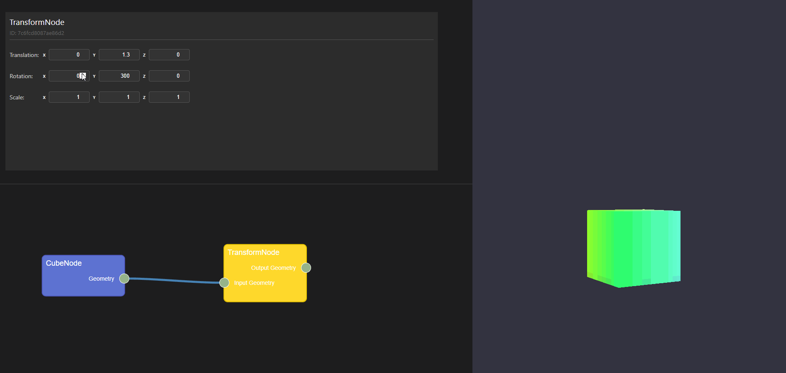
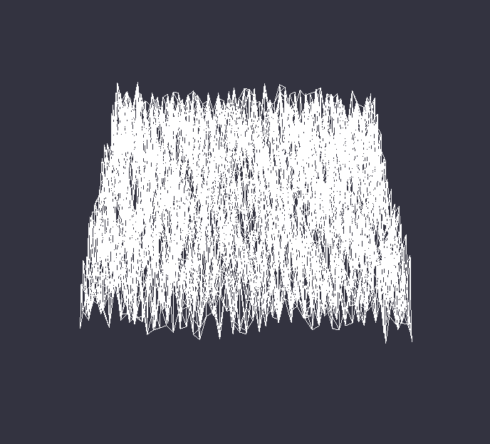
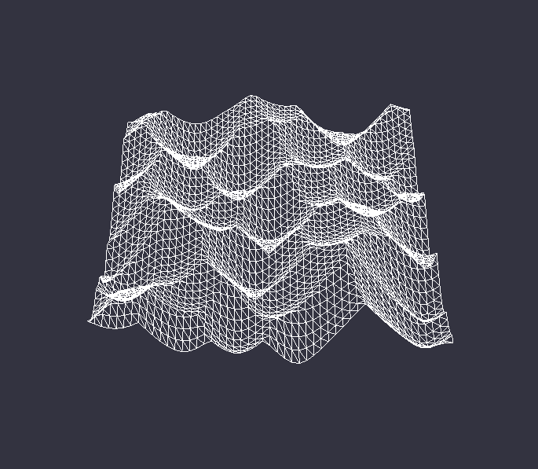
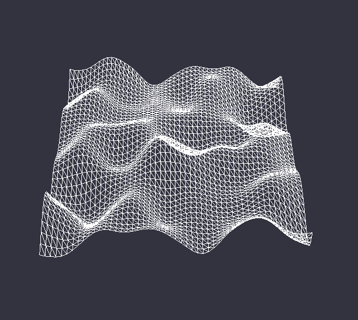
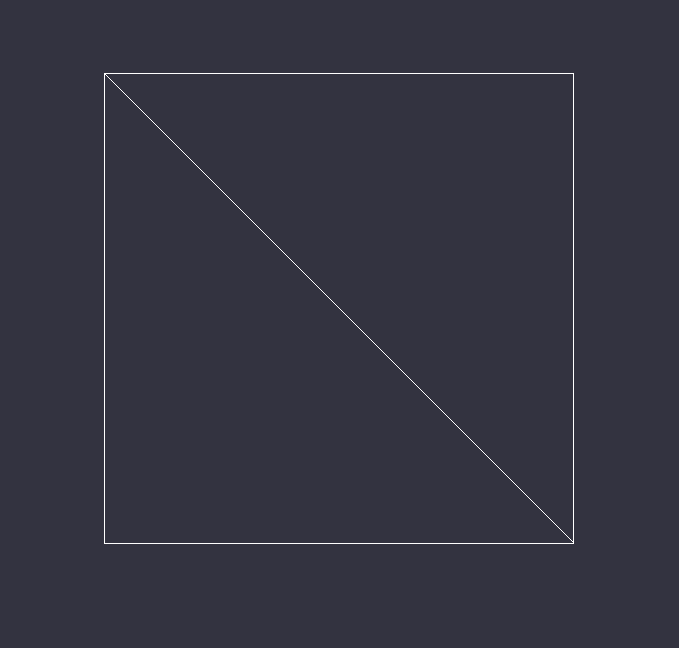
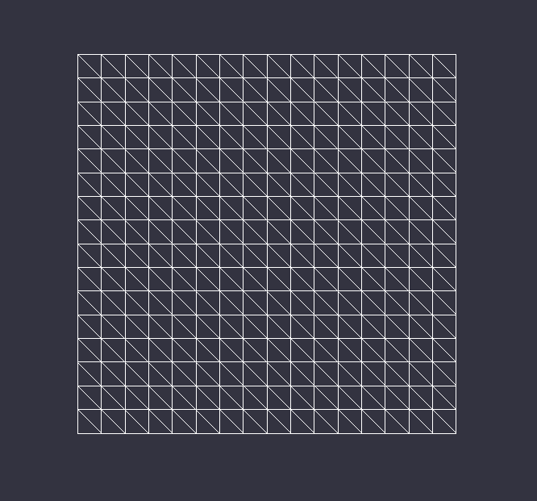
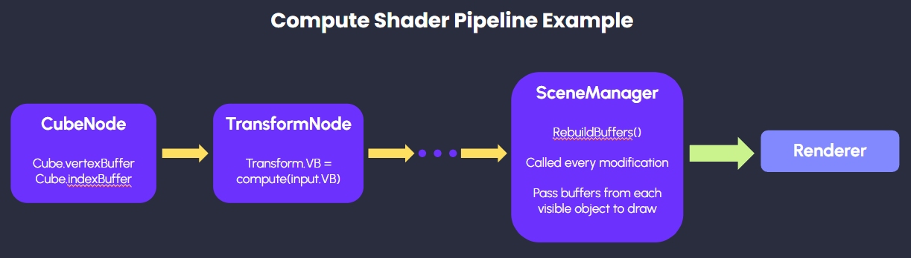
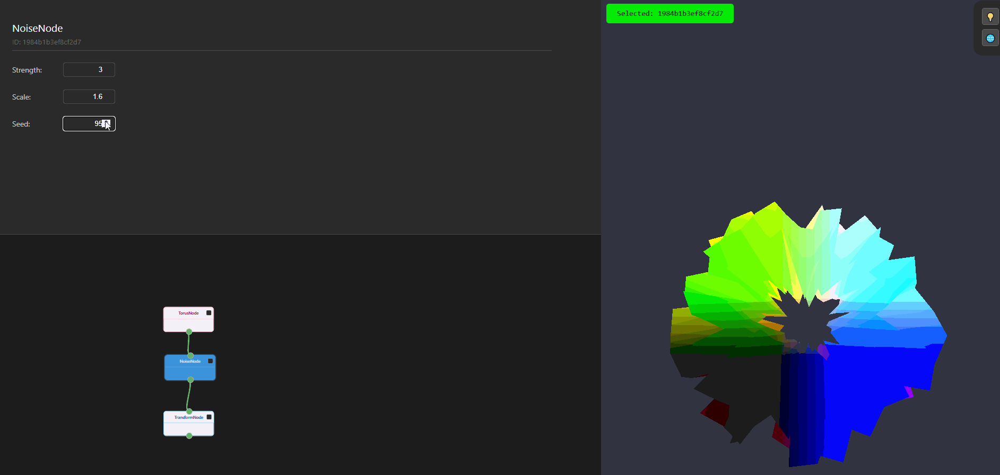

# SimuNet

A WebGPU Node Based Procedural Generator focusing on simulations.

[Demo link](https://sagescherrytree.github.io/SimuNet/)

## Concept and Goal

Our concept is very simple; to make a node based procedural tool on WebGPU, because it is simple to access, and runs fast on a GPU. Similar to Houdini, this system would use nodes to spawn geometry, and one can modify them also through node based logic. We propose to use nodes corresponding to compute shaders to act on all the data which is passed through. Parameters, if present, will be exposed via nodes, which is the visual component that the user is able to interact with. WebGPU is also used to render the results of each of the compute shaders, so the user can easily follow what happens in each step of the process, in addition to it being fast as it runs on the GPU. 

## Simulations

SimuNet will be focused on simulations, as its name implies. We will be focusing on implementing the following physics based simulations for the time being.

#### Proposed Simulations

- [*] cloth simulation
- [*] noise based deformation
- [*] rigidbody

We aim to construct the system such that we can easily add in new simulations as compute shaders to modify the input. 

## Milestone 1

[Presentation Link](https://docs.google.com/presentation/d/1P4i5c0qahVdIlbv1cDaszm3CENs7U_gj6FwvsZWp5yE/edit?usp=sharing)

#### Milestone 1 Goals

- [x] Basic node functionality.
- [x] Basic GUI using React.js and Rete.js.
- [x] Renderer to visualise primitives.
- [x] Basic geometry nodes (cube, icosphere, transform).

For Milestone 1, we completed the skeleton for our node network. We used the Rete.js library to construct the node GUI, and we set up the basic renderer.ts pipeline to render cubes and icospheres to the viewport. We also implemented the node connection structure (naive), and transform node which modifies the input geometry. 

## Milestone 2

#### Milestone 2 Goals

- [X] Restructured Milestone 1 code.
- [X] Noise and deformation node (GPU).
- [X] More base geometries.
- [X] Rendering options (basic lambert shader).

### Code Restructuring

### New Nodes and Features

#### Noise Node

Our noise node now contains three options for noise.

|  |  |  |
|:--:|:--:|:--:|
| Simple Noise | Worley Noise | Perlin Noise |

The noise modifications all now run via compute shaders.

#### Plane Node

Our plane node now includes subdivisions! 

|  |  |
|:--:|:--:|
| Subdivision = 1 | Subdivision = 16 |

### Compute Pipeline

In this milestone, we introduce a compute pipeline to run our modifications to each of the primitives that we create. Illustrated in the diagram above, we create vertex buffers and index buffers to hold the primitive data. In the modification nodes (e.g. the TransformNode in the example), the vertex buffers and index buffers get passed through the node, and will be updated for any new modification. 

Let us take the TransformNode as an example to look at how modifications are propagated. Each node, as stated above, will take in its source vertex buffer and source index buffer. For Transformations, we only specifically modify the vertex buffer. This gets modified through a compute pass, where the buffer gets passed into a compute shader that applies the transformation, and the results then get saved in an output vertex buffer and propagated further downstream. For each update, only the current node and its descendents get updated.

Currently, we use multiple draw calls, one per each object that is set to be visible, to update our geometry visuals on the renderer.

### Rendering Options

Output meshes can be displayed using simple normal-based lighting or using a gradient based on vertex positions. They can also be viewed either as solid objects or as wireframes.

https://github.com/user-attachments/assets/838f89b6-0260-4624-a93a-32b23c7baa30

## Milestone 3

#### Milestone 3 Goals

- [] Physics simulation nodes.
- [] Import/export.

# Libraries used

- [Rete.js](https://retejs.org/)
